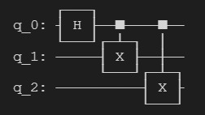
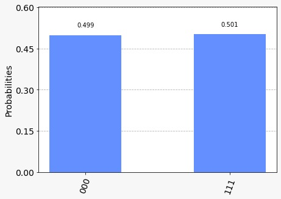

<style>

.poster {
    max-height: 85vh;
}

</style>

# A hackathon with a twist!

<p align="center">
  
</p>

The Schrodinger-Week Hackathon has become an annual tradition now, where the **Turing Club** and **φ@I** collaborate to bring you a one of its kind hackathon in computational physics. The hackathon will test your creativity in solving problems, and also require you to use some basic skills from physics in general and computational physics in particular.

You can use any language of your choice, but obviously, Julia and Python are preferred. You can also use different languages for different questions. Make sure you don't use any fancy libraries. You can look into the [rules](./rules) for details.

Before starting please register. We will not be able to accept your solutions without you registering. Each team of maximum 3 people needs to register only once.

Also join the WhatsApp group for doubts, hints etc. Link will be shared on Φ@I and Turing Club groups to prevent spamming.

Feel free to contact the organizers if you need additional information.

## [Click here for Rules](./rules)

# Questions

## Question 1[40 Marks]

[Sunspots](https://en.wikipedia.org/wiki/Sunspot) are phenomena on the Sun's photosphere that appear as temporary spots that are darker than the surrounding areas. They are colder than the region surrounding them. The origin and behaviour of sunspots is not very well understood. They show some periodic variation which is co-related to the solar activity. Your task is to analyse this [data](./rgo_sunspot_area_data.txt) taken by the [Royal Greenwich Observatory](https://en.wikipedia.org/wiki/Royal_Observatory,_Greenwich). The data contains the variation of sunspot area(Use the spot area column in the file. You can ignore the umbra area column) are with time and latitude on the surface of the sun. The following are the 2 tasks you need to perform-

1. Make a 2D plot showing the variation of the sunspot area with time and latitude. Put latitude on the y-axis and time on the x-axis. You can use a colormap or change the size of points to mark the area on the plot
2. Divide the surface of the sun into latitude bins, each of size 5 degree. Find the mean area observed in each of these latitude bins yearly and find the periodicity in this area for a given bin as input.

**Note**: The usage of astropy is allowed for this question.

### Input

`Text file path`

### Output

1. 2D plot showing the variation of the sunspot area with time and latitude.
2. Periodicity in yearly mean area in each latitude bin.


# Question 2[60 Marks]
This is a Quantum Computing question. Why? cus why not?

## Library Installation and importing

1. You need to install ```qiskit``` module using the command ```pip install qiskit```.
2. Now you have to do ```from qiskit import QuantumCircuit, Aer, execute``` and ```from qiskit.visualization import plot_histogram```.

## Some Physics and Conceptual Pre-requisites
1. In Quantum Computing, we have qubits which are quantum bits in place of classical bits. A qubit can be understood as a spin 1/2 system with 2 states: spin-up and spin-down or in computational basis as state 0 and state 1 but a qubit can also exist in a superimposed state of 0 and 1 unlike classical bit which only have 2 states.
2. Similar to Classical Gates, we have Quantum Gates, which are Unitary Operations on qubits. Some examples of these are: X, Y, Z, S, H(Hadamard gate), CNOT gates. Note that X, Y, Z, S and H gates are single qubit gates that is they can only take one qubit as input while CNOT gate is mutiple qubit gate(generally 2 qubit gate) meaning it takes 2 qubits as input. 
3. The qubits are represented on a three dimensional sphere called Bloch Sphere where each point on sphere represents a qubit state. Single Qubit gates mentioned above are just rotations of qubit state vectors on this Bloch Sphere.
4. CNOT gate is special in the sense that it entangles two qubits. It works in following way, we have 2 qubit inputs, one is called control qubit and other is target qubit. Now, let the state of controlled qubit be 0, then there is no effect on state of target qubit, meaning if initially we have target qubit state 0, it will remain 0 and if it is 1, it will remain 1. However, if state of controlled qubit is 1, then the state of target qubit is flipped, that is if initially target qubit state was 0, it will become 1 and if it was 1, it will now change to 0. So, CNOT gate acts as NOT gate for target qubit but only gets "on" when controlled qubit has the state 1.
5. In this way, CNOT gate entangles the 2 qubits. We can generalize the idea to N qubit, we just have to apply CNOT gate between them.
6. Now, we define depth of circuit as total number of layers, where each layer can contain at maximum one operation on one qubit. So, If we try to put X gate and Y gate on a qubit, then they go into different layers and depth is 2. However, if we try to put X gate on qubit 1 and Y gate on qubit 2, then it goes into same layer and depth is 1. Similarly for CNOT gates, if CNOT is applied between qubit 1,2 and qubit 3,4 then they go into same layer but if CNOT is applied between qubit 1,2 and 1,3 then they go into different layer hence increasing depth of circuit.


## Some code

1. You can initialize a Quantum Circuit object by using the command ```qc = QuantumCircuit(n)``` where n is the number of qubits you are taking into account.
2. Now you can apply various gates on qubits. For example:
   * ```qc.x(a)```: X gate on qubit a
   * ```qc.y(a)```: Y gate on qubit a
   * ```qc.z(a)```: Z gate on qubit a
   * ```qc.s(a)```: S gate on qubit a
   * ```qc.h(a)```: H gate on qubit a
   * ```qc.cx(c,t)```: controlled-X (= CNOT) gate with control qubit c and target qubit t
3. You can measure the depth of the circuit by using ```qc.depth()``` and you can view a diagram of your circuit using ```qc.draw()```.

## Example

Below is an example of entangling 3 qubits:

```python
qc = QuantumCircuit(3) #creates quantum circuit object with 3 qubits
qc.h(0) #hadamard gate on qubit 0
qc.cnot(0, 1) #entangling qubit 0 and qubit 1
qc.cnot(0,2) #entangling qubit 0 and qubit 2 (Note that here, qc.cnot(1,2) would also have done the same)
qc.draw() #prints a circuit diagram
#qc.depth() #should give 2 for this case

```
On running the above code, you will get:





Now you can check whether your state is entangled or not by using following set of lines:

```python

qc.measure_all() # we measure all the qubits
backend = Aer.get_backend('qasm_simulator') # we choose the simulator as our backend
counts = execute(qc, backend, shots = 10000).result().get_counts() # we run the simulation and get the counts
plot_histogram(counts)
```
In this case you will get,



You should get only 2 states which will be all spin up or all spin down for all qubits to be entangled.
## Question

Write a function which takes in n, the number of qubits as argument, applies Hadamard gate(H gate) on first qubit and then entangles all qubits in minimum possible depth.

### Instructions:

#### Input:

`Some_function(n)`

#### Output:

`Minimum possible depth and the circuit diagram`

### Sample:

#### Input:

`Some_function(3)`

#### Output:

`3`


(Note: The image can vary from given since there are 2 ways to entangle 3 qubits with depth 2)

## References:

Qiskit documentation


## Question 3[80 Marks]

Given a ray and N mirrors between two infinite boundaries at $$x = 0$$ and $$x=10$$, find the point where the ray hits the wall at $$x=10$$. Print None if it doesn't hit the wall.

### Input : 

`N`

`2 coordinates of starting Ray`

`Nx2x2 Matrix for locations of mirrors`

### Output :

`Y coordinate if it hits and None if it doesn't.`

### Sample :

#### Input :

`1`

`0,0,7,7`

`[[(0,5),(10,5)]]`

#### Output :

`0`


## Question 4[80 Marks]

There are 2 balls, at $$x=0$$ and $$x=10$$, and an elastic wall at $$x = 0$$. The ball at the origin is given a velocity $$10m/s$$ to the right. Compute the total number of collisions that occur.

### Input

`Masses of balls`

`Velocity`

### Output :

`Number of collisions`

### Sample :

#### Input:

`1,1`

`10`

#### Output :

`31`


## Question 5[100 Marks]

Two massive particles of mass $$m_1$$ and $$m_2$$ are constrained to move on a ellipse of semi-major and semi-minor axis $$a$$ and $$b$$ centred at the origin, lying in a plane. They interact gravitationally and are placed in a potential that goes as $$kr^4$$. Take $$G=1$$.

### Input

`Initial position and velocity of particles`, `R`, `m_1`, `m_2`, `k`

### Output

`A gif showing the trajectory of the particles for 100 time units.`

# Done!

- Rename all your files as `Qx.ext`
- Put them into a zip/tar file with name `SWH-<teamname>.zip`/`SWH-<teamname>.tar`
- Mail them to `phiclub@iisermohali.ac.in`

# Enjoy!

Good Luck!


# Want a look at the earlier hackathon. Here it is-

- [SWH 2021](https://iiserm.github.io/schrodinger-week/code-the-matrix)



